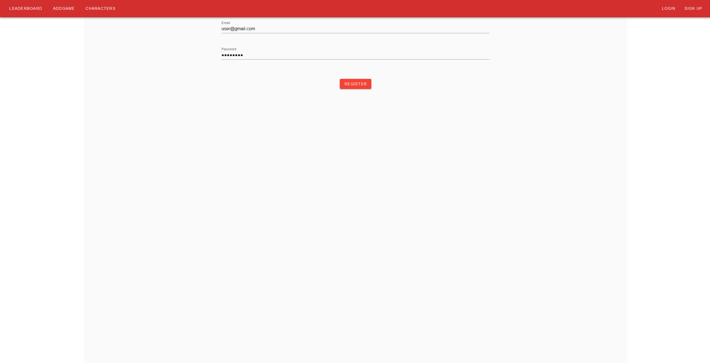
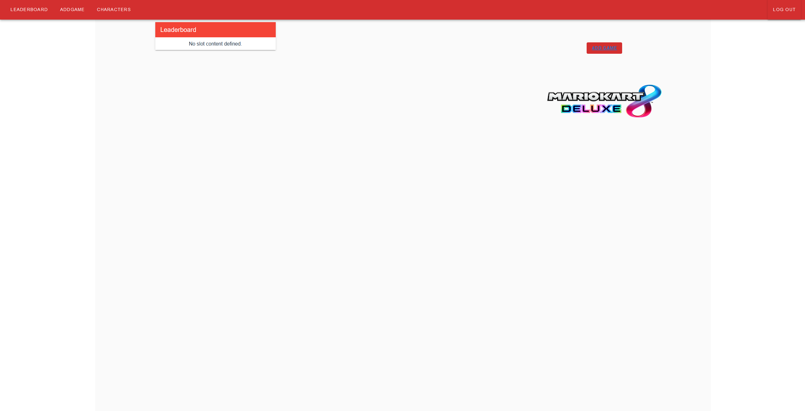
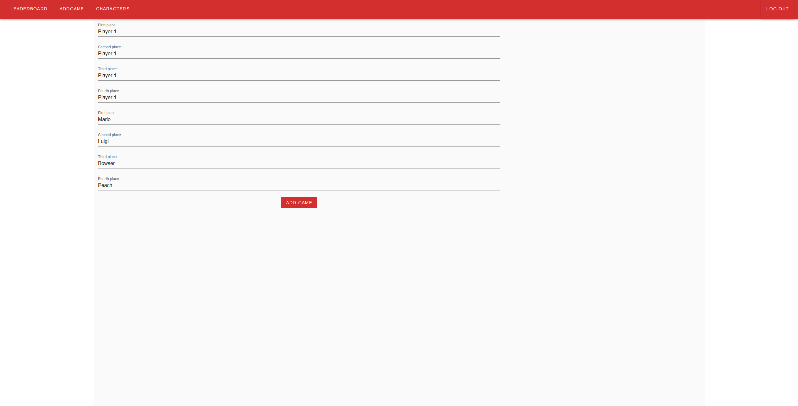
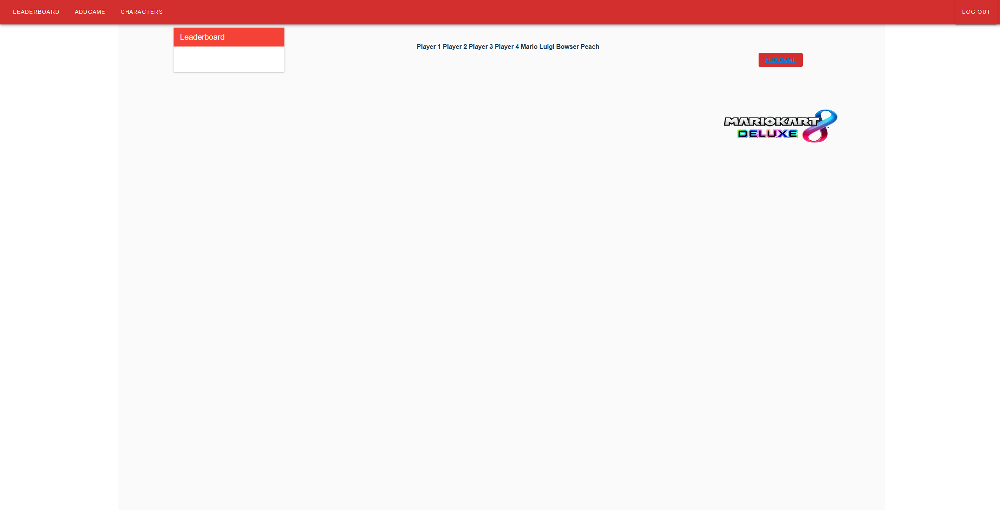
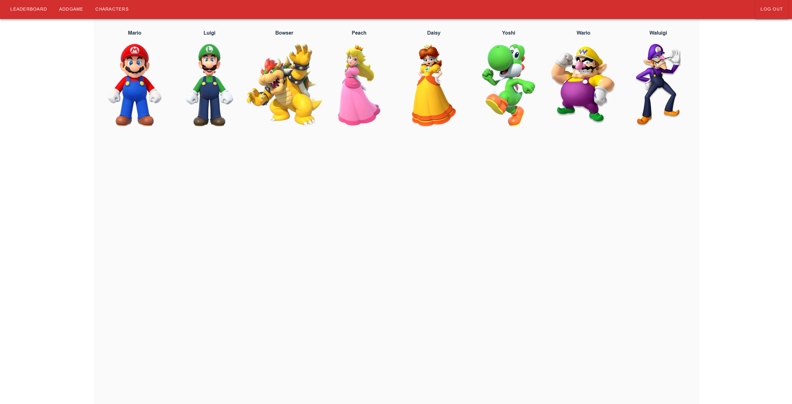

# Mario Kart Competition Stats

## Presentation

The main goal is to provide players with a way to use more information than the basic Mario Kart 8 Deluxe stats, which they will enter themselves, to let players know who is really the best driver to the end of a competiton.

## Getting Started

Here is the register page :

Ici s'affiche le classement des meilleurs joueurs, selon le nombre de 1ère places remportées :

Cette page permet d'insérer le nom du joueur, ainsi que le personnage joué, selon l'odrdre d'arrivée.

Voici l'affichage des parties en liste :

Et enfin le panel de personnages disponibles :

## Used tool

This is the list of all used tool used in this course :

* [Express.js](https://expressjs.com/fr/)

* [Vuetify](https://vuetifyjs.com)

* [Postman](https://www.postman.com)

* [Visual Studio Code](https://code.visualstudio.com)

* [Discord](https://discordapp.com)

## Authors

* **Lucas HERVOUET** - [GitHub](https://github.com/ChevreNeutron)

* **Antonin LATOUR** - [GitHub](https://github.com/AntoninLatour)
